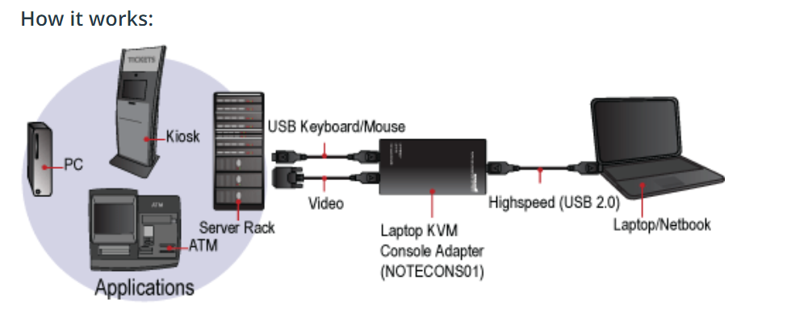
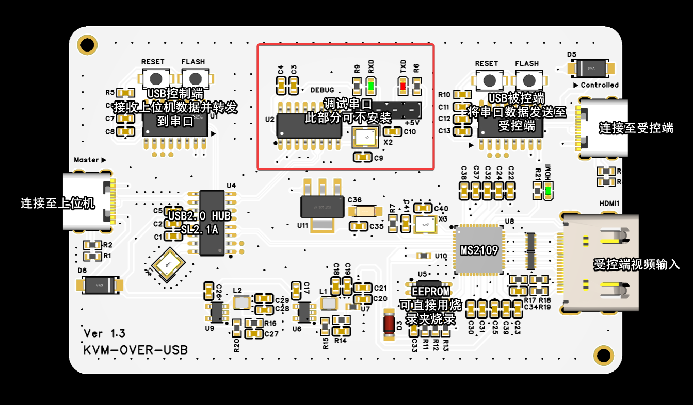
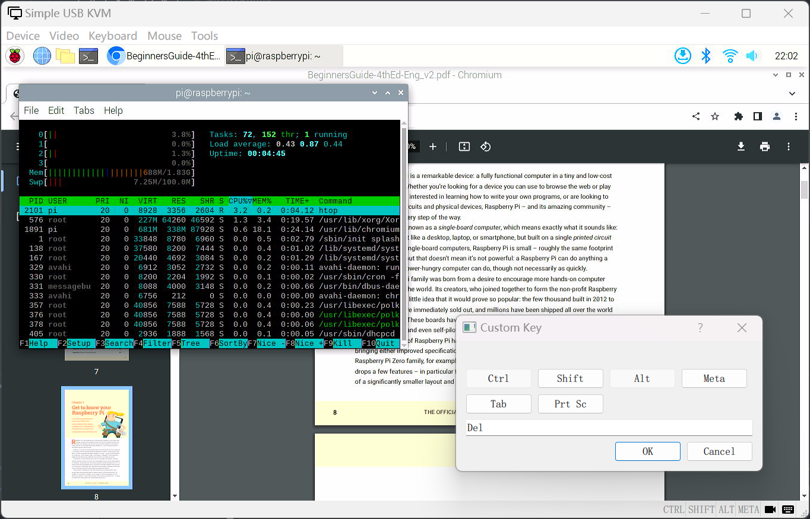
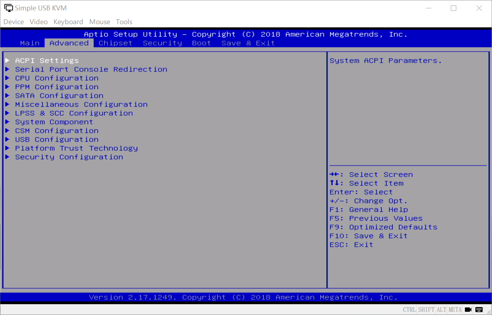
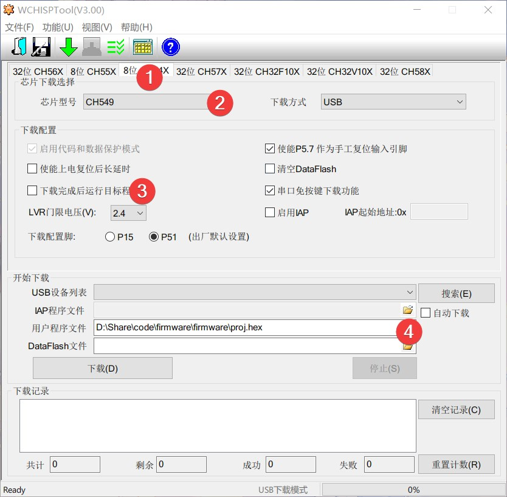

⚠️此项目已停止更新⚠️

后续项目开发转移至->[KVM-Card-Mini](https://github.com/Jackadminx/KVM-Card-Mini)

# KVM-Card
🖥️ Simple KVM Console to USB

实现一个简单的 KVM （Keyboard Video Mouse）功能，通过上位机程序实现对客户端的屏幕监控（HDMI）和键鼠控制（USB）
~~捡垃圾必备~~

>图片来自网络

## 简单硬件分析

- 两颗CH549实现数据传送和USB键鼠功能（技术太菜搞不定双USB的STM32，所以选了这个方案）。
- MS2109实现视频采集卡功能，在上位机显示被控端屏幕。
- SL2.1A将采集卡、USB串口、CH549的USB连接到一起。
- CH340G USB转串口可不安装，用于软件调试。

## 控制端软件
简单的KVM客户端

- 实现屏幕显示（支持输出切换分辨率）
- 客户端键盘控制、自定义快捷键
- 客户端鼠标捕捉和控制，捕获鼠标后按下键盘右CTRL键释放，操作逻辑类似于VirtualBox(

## 固件刷入
### CH549
按住Flash键并将USB插入即可刷入固件
使用[WCHISPTool](https://www.wch.cn/downloads/WCHISPTool_Setup_exe.html)刷入固件
两颗CH549都需要刷入固件，固件自动识别主从

### MS2109

配套的AT24C16 EEPROM可以直接买套片，或者用EEPROM编程器烧录。
可以使用烧录夹在板子断电状态进行烧录。

MS2109的固件来自 [Yuzuki HCC HDMI](https://oshwhub.com/gloomyghost/yuzuki-hcc) 项目，可通过HEX文件编辑器编辑固件实现修改设备名。

## 感谢
https://oshwhub.com/gloomyghost/yuzuki-hcc

https://materialdesignicons.com/icon/

https://www.riverbankcomputing.com/software/pyqt/

https://github.com/apmorton/pyhidapi

https://www2.keil.com/mdk5

和其他开源项目
